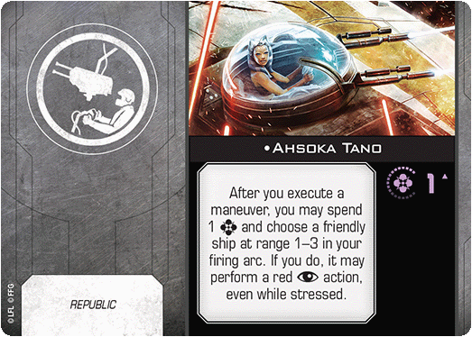
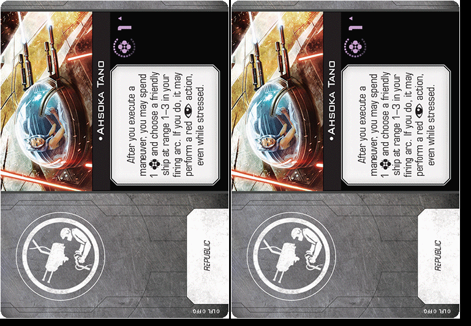

# X-Wing Photo-Format

A module to convert a X-Wing card into a format for print on photopaper 9x13cm.

This is helpful if u want to build a squad, but are missing some vital cards.

## Inputs:
get_photo function
- url: Weblink to the card (see https://infinitearenas.com/xw2/images/)
- spacing: Spacing between the Cards in pixel

## Returns:

- A Pillow Image of the card in photoformat (9x13)

## Note

[printer-poc](printer-poc.ipynb) is a Jupyternootebook ready to use for a single Card at a time.  
[printer](printer.py) is a Module which can be used to convert Cards, e.g. in combination with datasources like https://github.com/xwingtmg/xwing-data2.

